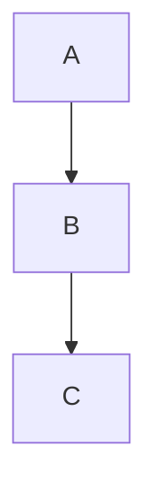

# mdbook-docgen

`mdbook-docgen` is a Rust CLI that scaffolds and maintains a clean, diagram-friendly **mdBook** documentation site.

It automatically generates landing pages, `SUMMARY.md`, and a human-readable overview page from the file-system layout. Mermaid and PlantUML diagrams render out-of-the-box.

---

## Features

| Task                       | Description                                                                    |
|----------------------------|--------------------------------------------------------------------------------|
| `docs/` scaffold           | Runs `mdbook init`, then appends pre-processor config.                          |
| `00.md` landing pages      | Auto-created in every sub-directory — required by `mdbook-fs-summary`.         |
| `SUMMARY.md`               | Rebuilt from the folder tree using **walkdir**, title-cased and indented.      |
| `overview/00.md`           | Overview page that lists real chapters (skips `00.md` / `SUMMARY.md` links).   |
| Diagram support            | Mermaid and PlantUML rendered via preprocessors.                               |
| GitHub Pages workflow      | Pre-configured Action that publishes to `gh-pages`.                            |

---

## Crates / Tools Used

| Crate / tool          | Purpose                                                      |
|-----------------------|--------------------------------------------------------------|
| `clap`                | Command-line parsing (`init`, `build`, `serve`)              |
| `anyhow`              | Error handling with context                                 |
| `walkdir`             | Recursive directory walk for `SUMMARY.md`, landing pages    |
| `convert_case`        | Converts file & folder names to Title Case                  |
| `chrono`              | Timestamps in the autogenerated overview                    |
| `mdbook-fs-summary`   | Builds sidebar from folder tree (needs `00.md` per folder)  |
| `mdbook-mermaid`      | Mermaid diagram pre-processor                               |
| `mdbook-plantuml`     | PlantUML diagram pre-processor                              |

---

## Installation

### macOS (Homebrew)

```bash
brew install mdbook plantuml graphviz
cargo install mdbook-fs-summary mdbook-plantuml mdbook-mermaid
mdbook-mermaid install docs
````

### Ubuntu / Debian

```bash
sudo apt-get update
sudo apt-get install mdbook plantuml graphviz
npm install -g @mermaid-js/mermaid-cli        # installs `mmdc`
cargo install mdbook-fs-summary mdbook-plantuml mdbook-mermaid
mdbook-mermaid install docs
```

> `mdbook-mermaid install docs` copies **`mermaid.min.js`** and **`mermaid-init.js`** into `docs/` so diagrams render.

---

## Usage

```bash
# Scaffold a docs site
cargo run -- init "My Docs"

# Build to docs/book/
cargo run -- build

# Live-reload server at localhost:3000
cargo run -- serve
```

Whenever you add or move Markdown files under `docs/src/`, the next build regenerates:

* `SUMMARY.md`
* `00.md` landing pages
* `overview/00.md`

---

## GitHub Pages Deployment

1. Add `.github/workflows/deploy.yml` (included in this repo).
2. Push to `master` (or `main`).
3. The action builds `docs/` and pushes to `gh-pages`.
4. In **Settings ▸ Pages**, set source to `gh-pages`.

The built-in `GITHUB_TOKEN` is sufficient; no PAT needed.

---

## Example Structure (this repository)

```
docs/
├─ book.toml
├─ mermaid.min.js
├─ mermaid-init.js
└─ src/
   ├─ overview/
   │  └─ 00.md # auto-generated TOC
   ├─ test1/
   │  ├─ 00.md # landing page for test1
   │  ├─ test1_1.md # example Markdown + Mermaid diagram + code block
   │  └─ test1_2.md # example Markdown + Mermaid diagram + code block
   ├─ test2/
   │  ├─ 00.md # landing page for test2 
   │  └─ test2_1.md # example Markdown + Mermaid diagram + code block
   └─ SUMMARY.md # auto-generated
```

> The `test1/` and `test2/` folders demonstrate the file-naming conventions, landing pages, and diagram support. Feel free to replace them with your own content.

---

## Notes

* Each sub-directory needs a `00.md`; `mdbook-fs-summary` treats it as the section index.
* Wrap diagrams in fenced code blocks:

<pre>

</pre>

---

## License

MIT — see `LICENSE` for details.
