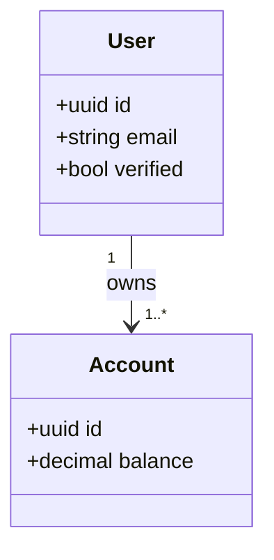

# 01 – Service Overview

Lup surm dolor sit amet, consectetur adipiscing elit.  
Praesent tincidunt **finibus** velit, non aliquet urna gravida a.  
Duis vitae eros sed augue sagittis lacinia.



```rust
// src/main.rs
fn main() {
    println!("Hello, payments-service!");
}
```

